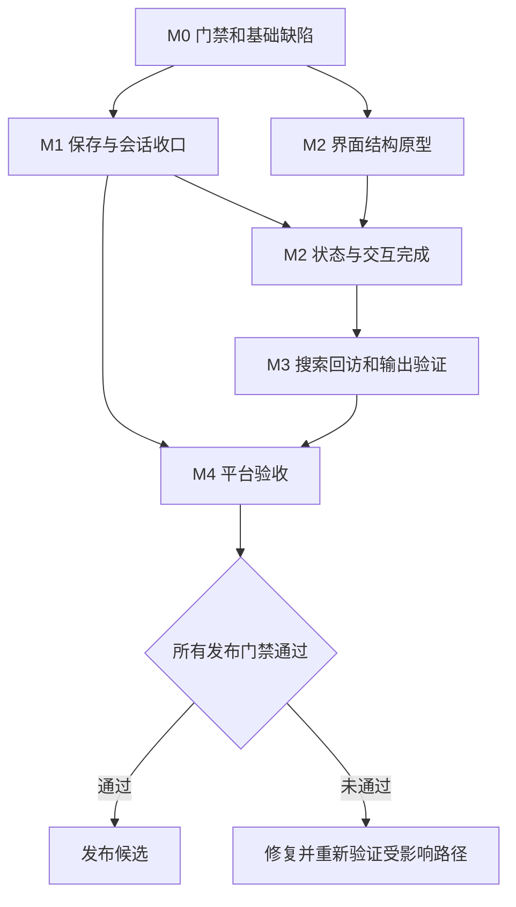

# Paperin 下一阶段发展与实施计划

日期：2026-09-13

状态：**滚动计划**。已完成的任务以 [REFACTOR-STATUS](REFACTOR-STATUS.md) 记录；下列条目只表示仍需推进或继续验证的工作。

基准：`d3ac991` / `0.6.0`，详见 [现状与产品评估](NEXT-PRODUCT-ASSESSMENT.md)。

界面设计依据：[NEXT-UI-SPEC](NEXT-UI-SPEC.md)。实际进度继续写入 [REFACTOR-STATUS](REFACTOR-STATUS.md)。

## 1. 目标与执行原则

目标是交付一个可以放心长期使用的本地 Markdown 知识工作台：工作区和文件位置清楚，输入与保存可靠，旧资料能找到并复用，已有导出能力稳定，验证能覆盖真实产品路径。

本计划不更换 Electron/React/Milkdown，不自动启动云同步、协作、移动端或插件市场，不把 AI 作为下一版默认主入口。所有产品扩展以实际用户任务验证为前提。

执行约束：

1. 遵循 AGENTS.md 的全部安全、测试、文档、文件拆分与提交门禁。
2. 每个任务先补失败测试，确认失败反映真实行为，再实现最小变更；测试修复同样不得弱化契约。
3. 一次只推进一个高风险状态变更；改保存协议时不同时改编辑器序列化和大面积视觉。
4. 凡所触及生产文件超过 450 行，先按职责拆分到可维护边界，再追加功能；组件超过 250 行及时评估拆分。
5. UI/schema/目录迁移有兼容说明和回退策略；用户 Markdown、历史、草稿与原始配置不得通过回退删除。
6. 一个功能验证完成立即提交；不提交构建产物、日志、用户路径、截图原件或真实知识库内容。
7. P0 表示正确性或发布证据阻塞，P1 表示核心体验/维护问题，P2 表示完成可靠基线后的优化。优先级不等于本次已复现数据事故。

## 2. 里程碑、投入与依赖

假设 1 名熟悉现有项目的工程师主力开发，能够取得设计反馈与平台测试支持。工作量为开发、直接测试、文档的粗估，不含未知故障和等待外部平台环境；按约 20% 缓冲、每周约 4 个有效工程日规划 **12–16 周滚动窗口**。以退出条件推进，不承诺日历到期自动发布。

| 阶段 | 目标 | 估计工程日 | 前置条件 | 可交付成果 |
| --- | --- | ---: | --- | --- |
| M0 | 恢复可信基线与确定性缺陷修复 | 4–6 | 本次评估 | smoke 有效、收藏可恢复、快捷键/计数正确、当前状态记录校准 |
| M1 | 保存、快照、会话与关键维护边界 | 10–15 | M0 的可靠验证入口 | 大文档正确性证据、保存协议收口、热点拆分 |
| M2 | 界面第二轮收敛 | 10–14 | M0；保存语义依赖 M1 | 顶栏/路径/轻大纲/窄窗口/外观与状态完整 |
| M3 | 搜索回访与输出闭环 | 8–12 | M1，M2 主骨架 | 搜索相关性与回访、现有导出质量、两周试用 |
| M4 | 平台与发布验证 | 6–8 | M0–M3 核心验收 | 三平台证据、安装升级验证、发布候选说明 |

合计约 38–55 工程日，缓冲后约 46–66 日。M4 的环境准备应在 M0 开始，实际安装包验收靠后；拿不到某平台环境时如实记录，不把其他平台结果当作替代。版本号在每次发布候选冻结时决定，本计划不先指定下一个正式版本。



图中表示工作依赖，不表示已分派并行代理或已启动后台任务。若有额外工程资源，可把 UI 原型与合成夹具准备并行，保存/迁移类任务仍由同一负责人把控。

## 3. M0：恢复可信基线

### T01 / P0：修复 Electron smoke 契约

- **现有问题**：测试读取已删除的 `.current-file-banner-title`，本次在系统关联步骤失败；性能 smoke 共用这段前置流程。
- **范围**：`src/main/testing/electron-smoke.ts`、必要的直接测试、`docs/system-file-open-and-close.md` 与兼容矩阵。
- **先失败测试**：现有界面结构下，活动标签名称、外部来源和正文标记一致；重复打开同一路径标签数不增加。
- **实现方向**：通过稳定的可访问语义/显式测试契约读活动文档；失败输出给出阶段与有限诊断。测试日志不输出用户路径或正文。
- **验收**：`npm run smoke` 完整走到真实保存、冲突、重读、重命名、搜索和状态读取；没有跳过断言、吞失败或给产品增加假元素迎合旧选择器。
- **回退**：仅回退测试变更；不得把“无法运行”重新记为通过。
- **依赖**：无；约 0.5–1 日。

### T02 / P1：补齐收藏恢复与更新一致性

- **范围**：`app/useSidebarFavorites.ts`、设置 typed API 的读取接线、收藏直接测试、与工作区文件操作的引用迁移。
- **先失败测试**：收藏后卸载/重挂载能恢复；A/B 库数据互不覆盖；加载期间点击不会丢操作；损坏配置可回退；读取失败不覆盖原记录；写入失败有反馈；重命名/移动/删除正确处理引用。
- **实现方向**：显式区分 loading/ready/error，加载完成再合并并持久化；使用现有 Main settings store，禁止 Renderer 读配置文件。跨窗口设置更新需确定合并策略，不能用过期全量对象覆盖其他窗口。
- **验收**：重启恢复成功；失败重试与取消路径保留数据；旧格式有迁移单测。收藏未完成加载时不把空数组当作真实用户删除。
- **依赖**：无；约 1–2 日。涉及超限工作区操作文件时先按 T08 小步拆出相关边界。

### T03 / P1：修复快捷键提示与文档计数

- **范围**：SidebarQuickNav、Sidebar/fileTree、快捷键配置与相关组件测试。
- **先失败测试**：默认快速打开显示 `Ctrl+P`；改键后提示同步；`Ctrl+K` 仍执行链接动作；深层目录中多个文件计数正确；空库、非 Markdown 附件、过滤和扫描截断分别处理。
- **实现方向**：由同一快捷键映射渲染提示；对归一化文件树递归统计 Markdown 叶子，扫描/索引/筛选统计用不同名称。
- **验收**：不能再出现根目录数量被显示为文档数量；所有展示入口与当前执行映射一致。
- **依赖**：无；约 0.5–1 日。

### T04 / P1：校准状态记录与恢复 CI

- **范围**：REFACTOR-STATUS、compatibility-matrix、CI workflow 与 `scripts/verify-ci-config.mjs`。
- **先失败测试**：验证 workflow 文件存在、目标 job 存在、步骤顺序正确，缺失 job 不能被切片逻辑误判。
- **实现方向**：恢复当前仓库适用的质量流水线，至少安装锁文件依赖 → typecheck → lint → test → build；适用 runner 增加 smoke。昂贵性能测量分独立 job，禁止自动重写基线。
- **验收**：本地配置检查通过，并有实际 CI 运行证据；三平台构建与人工安装验收分别记录。不顺带发布到旧项目仓库。
- **依赖**：T01 决定 smoke 步骤；约 1–2 日，远端 CI 等待另计。

### M0 退出条件

- [ ] T01–T04 的实现、直接测试、说明和独立提交齐备。
- [ ] smoke 不再在过时 DOM 契约处失败。
- [ ] 收藏重启、真实快捷键与文档计数有行为测试。
- [ ] 当前状态不再引用旧 smoke 的通过作为当前通过证据。
- [ ] 大文档若仍失败，已记录准确失败阶段和后续任务，不宣称重构完成。

## 4. M1：文件与编辑器可靠性

### T05 / P0：建立可等待的编辑快照契约

- **范围**：Editor adapter/listener、文档会话保存/关闭/草稿路径、必要的 Shared DTO；触及超限实例与编排文件前先拆分。
- **核心不变量**：编辑器为唯一可编辑正文源；会话快照有来源版本；磁盘确认只确认本次提交的版本。保存期间继续输入，dirty 必须保留到新版本写盘。
- **建议设计**：在内存中区分 `editorRevision`、`snapshotRevision`、`persistedRevision` 与文档 session ID。保存请求先确保获得目标版本快照，再入队携带 `expectedMtime` 的写盘操作；返回时只更新该文档、该版本的确认信息。
- **版本语义**：用户点击保存时捕获目标版本；采集期间若有新输入，可提交更新版本，但不能退回较旧缓存；新输入尚未写入则保留 dirty。不要以比较同一个旧缓存与旧基线来宣布已保存。
- **接口原则**：可设计 renderer 内部异步 `ensureSnapshot`，但具体签名经设计审查决定；不要把当前同步 `getMarkdown` 在所有调用点机械换成 Promise。新 IPC 如确有必要，按 Shared → Main → Preload → api.d.ts → Renderer → 测试同步。
- **大小口径**：现有阈值为字符串长度，先给阈值按实际单位命名并覆盖中文/emoji 边界；若改为 UTF-8 字节，明确兼容和性能成本，不在每次按键无条件全量编码。
- **验收**：即时保存/关闭测试通过；等待有进度与失败出口；不保存半截流式文档、不丢字符、不跨文件应用快照。
- **依赖**：T01；约 4–6 日。

### T06 / P0：补齐端到端正确性矩阵

| 维度 | 必测案例 | 正确性断言 |
| --- | --- | --- |
| 内容大小 | 普通文档、阈值前后、5 MiB | 最新编辑标记和文档尾部完整落盘 |
| 时序 | 输入后立即 Ctrl+S、0–200ms 关闭/切换、保存中继续输入 | 不遗漏末次输入、不错误清除 dirty |
| 输入法 | 中文组合中、compositionend 后立即保存 | 不提交未完成候选，不吞最后提交文本 |
| 磁盘 | 外部修改、同尺寸修改、删除、权限失败 | 冲突不静默覆盖，失败后内容保留 |
| 编码 | UTF-8/BOM、UTF-16、GBK 不可映射字符 | 明确转换或取消，字节/文本可核验 |
| 会话 | 重启恢复、多窗口同文件、恢复中卸载 | 不串文档、不复活过期草稿、不覆盖其他窗口新输入 |
| 文件操作 | 编辑后重命名/移动/删除/另存为 | 保存失败中止后续动作；成功后引用一致 |
| Markdown | 公式、Mermaid、代码、脚注、frontmatter、表格、任务列表 | 正常/中文/异常输入往返语义不丢失 |

先通过合成夹具复现，再做真实 Electron；记录磁盘文本或 hash 与编辑版本对应关系，不仅检查 DOM 有 marker。脚本 IME 事件不能替代平台真实输入法手测。

依赖 T05；约 2–3 日，复杂失败排查使用缓冲。

### T07 / P1：定位序列化与渲染开销

- 分别测量解析、EditorState 装载、DOM 更新、快照序列化、IPC、磁盘落盘和导出，记录哪一阶段阻塞。
- 历史对话框的正文快照改为实际打开时获取，避免 `AppComposition` 每次渲染求 `liveContentOf`；验证关闭的低频 UI 不会触发全文序列化。
- 先消除重复全文工作，再判断增量序列化或 Worker。ProseMirror 实例/DOM 不能直接移到 Worker；如传可序列化快照，必须计入复制成本和插件兼容性。
- 大文档保护方案必须清楚呈现：正在装载、可取消、必要时只读预览由用户明确选择。保护模式不能替代现有 5 MiB 编辑保存门禁，也不能降级后仍宣称该场景通过。
- 图谱低频加载可单独优化，但不可用分块体积下降替代首屏/切换延迟测量。

验收：真实 Electron 5 MiB 与 20 标签门禁得到完整结果；正确性断言和监听释放均通过。依赖 T05–T06；约 2–3 日。

### T08 / P1：按风险顺序拆分关键模块

| 顺序 | 文件/领域 | 新边界方向 | 直接测试 |
| --- | --- | --- | --- |
| 1 | file-handlers | 读取授权、保存服务、另存为、附件/CSS handler | 可信路径、冲突/编码、取消/权限、原子写入 |
| 2 | useWorkspaceFiles | 创建、重命名/移动、删除、路径引用迁移 | 并发切标签、失败中止、收藏/标签/草稿迁移 |
| 3 | useAppSettings | settings 加载/校验/应用、域级持久化 | 卸载/取消、旧 schema、读取失败、跨工作区 |
| 4 | AppComposition / editor instance | overlay 协调、插件装配、光标/脏状态上报 | 回调归属、实例不重建、监听和定时器释放 |
| 5 | overlays / Mermaid / docx | 按交互/渲染/序列化职责拆分 | 焦点/IME、异步取消、输出回归与资源安全 |

与 T05–T07 按触及范围结合执行，不再叠加计算全部工期；专门收尾约 2–3 日，未完成的低风险拆分跟随 M2/M3 对应功能。超过门禁的文件不得以“后续再拆”为理由继续加功能。

### M1 退出条件

- [ ] 数据安全矩阵和真实大文档流程有通过证据，或明确保持发布阻塞。
- [ ] 快照新鲜度由版本契约保证，阈值单位与文档一致。
- [ ] 20 标签切换显示正确内容，关闭后监听/缓存按策略释放。
- [ ] 超限热点按职责收敛，拆分新模块有直接测试。
- [ ] 当前性能结果与当前 commit 绑定，未用旧结果替代。

## 5. M2：界面第二轮收敛

### T09 / P1：来源、持久化与错误状态模型

将文档种类（示例/未命名/真实文件）、来源（库内/外部）、保存阶段分开，优先用派生 UI 模型，必要时才做 schema 迁移。按 UI 规范的状态表实现文案和操作；重命名不改正文 H1。

先测试无路径且 dirty=false 不显示“已保存到磁盘”、保存旧版本后新输入仍 dirty、冲突与编码取消保留内容、无活动文档不展示旧文件状态。依赖 T05–T06；约 2 日。

### T10 / P1：顶栏、路径条与导航层级

减少重复标题/来源胶囊，库名集中侧栏、文件名集中标签、路径集中轻面包屑；保留菜单与命令可发现性。先在 1/20 标签、同名不同目录、外部文件和窄窗口上写组件测试，再调整 UI。

验收必须检查标题重命名失败恢复、当前文件在树/标签/路径中一致、窗口拖拽不吃点击。依赖 T03、T09；约 2–3 日。

### T11 / P1：统一抽屉和焦点协调

共享一个 overlay 协调状态表示当前打开的左右抽屉，明确与菜单/对话框的层级；持久化布局偏好与瞬时 overlay 状态分开。

先测试左右切换、Escape、焦点圈定、关闭后恢复、窗口缩放、触发控件被删除、中文组合态；随后真实 Electron 100%/125%/150% 缩放手测。依赖 T10；约 2–3 日。

### T12 / P1：可读性与主题语义

拆分装饰线、必要控件边界、焦点环和辅助文字 token；逐项处理实际用途，不整体拉深所有分隔线。43 项旧组合按控件风险与主题处理，`text-3/text-4` 不能整体豁免正常信息文字。

先为对应主题/状态写失败组合测试，再补 DOM 实际使用抽样和键盘验证；各内置主题必须过文本、边框、禁用、悬停、焦点、弹层与系统标题栏检查。允许装饰/停用例外，但必须记录用途，不能扩大豁免掩盖回归。依赖 T10；约 2–3 日。

### T13 / P2：轻大纲、排版预设与主题样张

沿用 ContextDock 增加轻大纲形态；统计默认收起但可键盘访问。外观设置添加相同样本的主题预览，阅读/宽内容预设保留用户参数。

测试模式切换、宽度恢复、标题导航不抢焦点、长中文标题、主题切换不重置字号/行距、宽表格局部滚动。依赖 T11–T12；约 2–3 日。

### T14 / P2：新用户与空状态

按无库、有库无标签、示例、未命名区分主动作；现有知识库恢复优先，关闭全部标签不会被欢迎页/图谱强行接管。将“对标某编辑器”的欢迎文案改成具体任务引导，统一产品显示名。

先测试不自动扫描任意目录、不向用户库写样例、不重建另一种单文件模式。安装身份迁移留给 T19。依赖 T09–T10；约 1 日。

### M2 退出条件

- [ ] UI 规范中的宽度/缩放/主题/状态矩阵完成。
- [ ] 真实 IME、焦点、Escape、菜单、标签与面板有人工和关键 E2E 证据。
- [ ] 正文与文件名不再因界面变更被自动改写。
- [ ] 6–8 名目标用户完成首轮任务；问题按严重度回填，不以主观“更好看”结项。

## 6. M3：搜索回访与写作输出

### T15 / P1：统一查找入口与相关性

先连接已有文件快速打开、命令模式和全文搜索入口；显示范围、相对目录、片段和位置。复用生产搜索与 `reveal`，不复制索引。

测试中文/混合大小写/同名/路径匹配、末尾文件命中、取消/新查询覆盖旧结果、扫描与结果双截断、查询失败保留输入。排序先用可解释规则，再比较固定查询集的 Top-5 命中。

依赖 M2；约 2–3 日。

### T16 / P1：回到上一处阅读与写作位置

为搜索/链接/诊断跳转保存必要的位置和视图信息；查询结果保持原查询与滚动。首版可用明确“返回上一处”命令，快捷键单独做冲突审查；不引入无限全局导航历史。

测试同一文档不同段落、跨文件往返、文件被改名/删除、旧异步响应、工作区切换和关闭标签。打开回退位置不能覆盖当前正文或创建重复标签。依赖 T15；约 1–2 日。

### T17 / P1：现有导出格式质量与边界

优先稳定 Markdown、HTML、PDF、DOCX，再说明其他现有格式的依赖与平台边界。若进入 DOCX 模块，先完成 T08 对应拆分。

建立合成中文样本文档：标题、宽表格、任务列表、公式、Mermaid、代码、脚注、frontmatter、相对图片和异常语法；输出逐格式检查正文、图片、分页、目录/链接、中文字体回退和错误处理。

现有性能 smoke 是 DOM → `exportBundle` 通道，不能代替真实 HTML/PDF/DOCX UI 流程。原生对话框取消、无权限、附件缺失、活动标签切换、超大文件和打印窗口释放均需要独立验收。

平台粘贴或发布渠道只做一个有试用依据的实验，不承诺任意平台格式一致，也不在本阶段自动上传内容。依赖 M1；约 3–4 日。

### T18 / P2：连续使用实验

招募 10–20 名目标用户进行两周试用，工程工作约 1–3 日、试用等待与其他工作重叠。记录查找资料、继续写作、保存/恢复和输出中的绕行，问题按 P0/P1/P2 排序。

判定门槛见评估文档：任务成功率、查找时间相对改善、第二周自然回访，以及是否完成有效编辑/输出。访谈原始私人内容不进仓库，只记录经许可的匿名汇总。

若用户主要抱怨基础流程，下一阶段继续打磨基础；只有反复出现具体需求才安排 AI、模板扩展或数字花园验证。

### M3 退出条件

- [ ] 查找 → 打开 → 返回 → 编辑 → 保存 → 导出有完整流程证据。
- [ ] 搜索覆盖限制清楚，不以空结果掩盖未扫描。
- [ ] 现有导出能力的支持/依赖/限制矩阵准确。
- [ ] 两轮用户验证结果形成短报告，下一阶段需求有任务证据。

## 7. M4：发布与平台验证

### T19 / P1：产品名称与安装身份

产品名称与安装身份已统一为 Paperin：UI 使用 Paperin，package name 为 `paperin`，appId 为 `com.paperin.app`，工作区状态目录为 `.paperin`，文件关联、更新源和安装包均使用 Paperin 命名。

测试 Paperin 配置、草稿、工作区打开、重复启动、多窗口、卸载后用户文档保留。品牌迁移已完成；不能把既有远程仓库直接当作新产品发布目标。依赖 T04、T14；约 1–2 日。

### T20 / P0 发布门禁：三平台安装和升级验收

| 平台 | 最低验证 |
| --- | --- |
| Windows | 安装/升级/启动、资源管理器双击关联、中文路径、权限失败、保存/冲突、打印/导出、标题栏缩放、多窗口 |
| macOS | 安装后启动、Finder open-file、菜单键位与焦点、保存/导出、系统权限、升级流程 |
| Linux | 安装/运行目标格式、MIME 关联、桌面环境差异、字体回退、保存/导出、升级或版本替换说明 |

构建矩阵不等于安装矩阵；开发态文件关联不等于安装态文件关联。先收集 Windows 证据不能降低完整产品发布所要求的三平台门禁。若未来调整支持范围，应单独更新产品承诺、兼容矩阵与验证计划，不在本任务中默认豁免。

依赖 M1–M3、T19；约 3–4 日，签名/系统环境等待另计。

### T21 / P1：发布候选与回退演练

生成版本说明、已知限制、安装验证记录和恢复指导；检查产物不含用户数据、密钥、源码映射或无关文件。已有安全输出、可信路径、CSP、图片与导出白名单继续执行对应测试。

演练升级失败、损坏配置回退、设置 schema 降级兼容与工作区恢复；备份元数据，验证旧版本可安全读取或给出明确不能降级的说明。回退不删除正文、不重置整个知识库、不把失败迁移结果覆盖旧配置。

依赖 T20；约 1–2 日。发布上传本身另行执行，本计划不会触发发布。

## 8. 性能与质量的量化口径

### 8.1 当前硬门禁与体验目标分开

现有 Electron 失效保护线为：5 MiB 打开 120s、保存 120s、资源包导出 60s、20 标签切换 P95 10s。它们用于发现卡死或数量级退化，**即使通过也不足以代表优秀体验**。

下一轮建议先采集、再冻结以下体验目标，不将未经测量的目标写成达成结果：

| 场景 | 候选目标 | 采样说明 |
| --- | --- | --- |
| 普通文档（建议夹具 ≤200 KiB）输入到可见更新 | P95 <50ms | 固定输入序列，分离 IME、Markdown 转换和 UI 绘制 |
| 20 个普通标签暖切换到正确内容 | P95 <300ms | 不只测标签样式，校验正文与位置 |
| 5000 文件全文搜索到首批可见结果 | P95 <800ms | 包含 Renderer 交互与 IPC；当前模块 P95 约 455ms 只是一部分 |
| 普通文档手动保存到磁盘确认 | P95 <500ms | 起点为用户动作，终点为当前快照落盘与状态确认 |
| 5 MiB 打开/保存 | 首轮争取 <10s / <5s | 分节点结构测试，无法达到时保留明确限制与优化任务，不牺牲内容正确性 |

这些是参考设备上的内部候选目标，不是产品 SLA。冻结时登记 CPU、内存、磁盘、OS、Node/Electron、构建 commit、GPU 模式和夹具特征。已有硬门禁不得为了得到绿灯而放宽；体验预算也不能以失败阈值直接代替。

### 8.2 采样与内存

- 普通场景至少 20 次样本，报告 P50/P95/最大值；冷启动至少 5 次单独报告，不能混入暖启动。
- 大文档至少覆盖长段落、很多短节点、长行、中文和复杂语法；不能仅用一种 256 段夹具推断全部性能。
- 内存分别记录 Main RSS、Renderer 指标和监听数；关闭 20 标签后观察回落/稳定情况，GC 时机不同不能用一次读数宣布泄漏已修复。
- 性能测试独立运行，保留聚合结果，不输出正文、绝对用户路径和搜索词。
- 同时打开保存、搜索、导出和 watcher 风暴的场景用于检查优先级和取消，不因追求吞吐量影响当前输入。

## 9. 通用测试与文档清单

每个功能必须完成以下适用项，仓库规则优先：

```text
失败行为测试 → 最小实现 → 新边界直接测试 → 相关回归
→ npm run typecheck → npm run test → npm run build
→ 适用的 lint / a11y / Electron smoke / 性能与平台验证
→ 文档同步 → git diff/status 检查 → 独立提交
```

| 变化 | 必须同步 |
| --- | --- |
| 用户功能、快捷键、设置、导出 | README/使用说明、command-panels、compatibility-matrix |
| 保存协议、错误码、DTO/schema | domain-model、document-tab-lifecycle、IPC/API 声明与迁移说明 |
| 组件/目录拆分 | 维护文档、import、直接测试、构建配置 |
| 视觉/主题/交互 | 本 UI 规范、ACCESSIBILITY-SMOKE、设计截图矩阵 |
| 性能 | performance-baseline 说明与绑定 commit 的结果；基线变更单独审查 |
| 实际完成度 | 仅 REFACTOR-STATUS 更新当前结果，历史审查加日期提示 |

测试资产优先使用隔离临时目录和合成内容。snapshot/字符串接线测试可以补充，但不能替代重启收藏、真实保存或焦点行为验证。

## 10. 风险与处理规则

| 风险 | 预警信号 | 处理 |
| --- | --- | --- |
| 继续扩功能导致再次膨胀 | AppComposition/设置/文件操作持续超限 | 暂停该模块新增功能，先拆职责与直接测试 |
| 大文档优化返回旧快照 | 延迟变低但磁盘缺少最后编辑 | 立即阻断发布，先恢复正确性，不以自动保存稍后补偿解释 |
| UI 变更使 E2E 假失败/假通过 | 选择器依赖旧 DOM、只查标签外观 | 改为来源、活动标签和正文/磁盘联合契约 |
| 搜索范围不完整却看似无结果 | 超预算库、超大文件被跳过 | 显示覆盖限制并保留文件树可见性 |
| 品牌替换丢失旧设置 | 改 appId/productName 后空白启动 | 独立迁移演练，保留旧数据和可回退读取策略 |
| 发布平台缺环境 | 只完成本地 build | 记录阻塞，不宣布目标平台支持已验证 |
| 小样本产品反馈失真 | 只有开发者或熟悉工具的人试用 | 招募目标画像，观察实际任务，保留负面结果 |
| 计划过大 | 同一周期开始 AI、同步、图谱改造 | 回到核心闭环，每阶段最多一个主要产品增量 |

## 11. 下一次开发的具体起步清单

建议首批顺序如下，日期按实际进度调整：

1. **第 1 个工作日**：重跑当前 smoke 复现 F01，为关联打开补稳定行为契约，修复后记录完整通过/失败阶段并提交。
2. **第 2–3 个工作日**：收藏恢复先写失败测试，补加载与合并；另做快捷键/统计小提交，避免混入视觉重构。
3. **第 4 个工作日**：校准状态文档和 CI 检查，准备大文档末次输入夹具与阶段计时。
4. **第 5 个工作日起**：执行真实大文档门禁，复现快照时序风险；形成保存协议的小设计和直接测试，再进入 M1。

首批任务完成之前，不把“新主题、AI 入口、更多图谱功能”作为下一个开发目标。完成 M0/M1 后，再把 UI 规范按 T09–T14 逐项落地，每次用相同合成笔记比较。

## 12. 最终完成定义

- [ ] 核心用户流程真实可用，来源/保存状态无矛盾。
- [ ] 本次发现的问题逐项有实现、行为测试和文档证据；待验证风险明确结案或继续阻断发布。
- [ ] typecheck、test、build 通过；适用的 lint、a11y、smoke、性能与平台验证通过。
- [ ] 所有目标平台的安装/打开/保存/导出/更新或升级说明均验证。
- [ ] 没有遗留的超限文件继续新增功能、重复可编辑正文状态或未经处理的取消分支。
- [ ] 文档中的版本、快捷键、主题数、兼容范围、错误码和 schema 与代码一致。
- [ ] 用户文件可正常迁出、恢复与回退，安装包和提交不含用户数据。
- [ ] 用户试用能解释产品价值；下一阶段需求来自任务证据，而非功能清单对齐。

满足这些条件才更新“重构完成/发布就绪”的结论；本计划的编写完成不等于产品已经满足这些条件。
